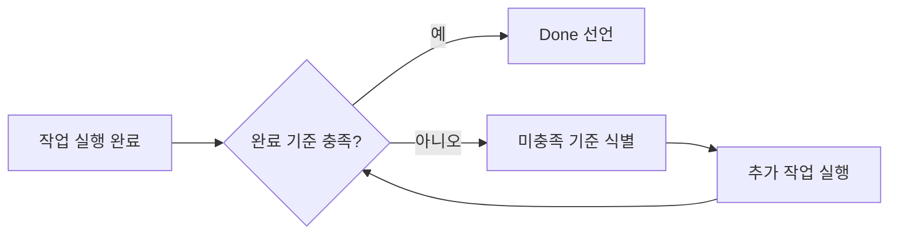

# 아키텍처

> oh-my-customcodex — oh-my-customcode의 GPT Codex + OMX 네이티브 child package

## 1. 시스템 개요

oh-my-customcodex는 oh-my-customcode의 child package로, parent 하네스의 구조와 워크플로를 유지한 채 실행 표면만 GPT Codex + OMX로 옮긴 포트입니다. 현재 shipped template surface는 48개의 서브에이전트, 106개의 스킬, 22개의 거버넌스 규칙, 훅 시스템으로 구성됩니다. 핵심 철학은 그대로 유지됩니다: **"전문가가 없으면? 만들고, 지식을 연결하고, 사용한다."**

현재 패키지 식별자: npm `oh-my-customcodex`, GitHub Packages `@baekenough/oh-my-customcodex`, CLI `omcodex`

### 1.1 컴파일레이션 메타포

oh-my-customcode parent가 정의한 컴파일 메타포를 oh-my-customcodex도 그대로 유지합니다. 규칙, 스킬, 에이전트 정의가 하네스 사양(spec)을 구성하고, child package인 `omcodex` CLI가 이를 Codex + OMX 런타임 표면으로 설치합니다. 이 메타포는 세 가지 핵심 이점을 제공합니다:

1. **사양 밀도 (Spec Density)**: 각 규칙과 스킬은 에이전트 행동을 최대 정밀도로 제어하는 압축된 사양 단위입니다.
2. **Takeover (역컴파일)**: 기존 프로젝트 구성을 분석하여 하네스 사양으로 역컴파일하는 패턴입니다 (`/omcodex:takeover`).
3. **결정론적 재현**: 동일한 사양 입력은 동일한 에이전트 행동을 재현합니다 -- 프로젝트 간, 세션 간 일관성을 보장합니다.

<p align="center">
  
</p>

---

## 2. 고수준 아키텍처

<p align="center">
  
</p>

---

## 3. 컴포넌트 인벤토리

### 3.1 규칙 시스템 (R000--R021, R014 없음)

| ID | 우선순위 | 이름 | 설명 |
|----|----------|------|------|
| R000 | MUST | 언어 정책 | 한국어 I/O, 영어 파일, 위임 모델 |
| R001 | MUST | 안전 규칙 | 금지 행위, 파괴적 작업 승인 게이트 |
| R002 | MUST | 권한 규칙 | 도구 티어 정책, 파일 접근 범위 |
| R003 | SHOULD | 상호작용 규칙 | 응답 원칙, 상태 포맷 |
| R004 | SHOULD | 오류 처리 | 오류 등급, 복구 전략 |
| R005 | MAY | 최적화 | 효율성, 토큰 최적화 |
| R006 | MUST | 에이전트 설계 | 에이전트 파일 포맷, 관심사 분리 |
| R007 | MUST | 에이전트 식별 | 모든 응답은 에이전트 헤더로 시작 |
| R008 | MUST | 도구 식별 | 모든 도구 호출에 에이전트+모델 접두사 포함 |
| R009 | MUST | 병렬 실행 | 독립 작업 2개 이상은 반드시 병렬 실행 |
| R010 | MUST | 오케스트레이터 조율 | 오케스트레이터는 절대 파일을 직접 작성하지 않음 |
| R011 | SHOULD | 메모리 통합 | 네이티브 자동 메모리 + MCP 보조 |
| R012 | SHOULD | HUD 상태줄 | 실시간 세션 상태 표시 |
| R013 | SHOULD | Ecomode | 작업 유형별 컨텍스트 예산 임계값 |
| R015 | MUST | 의도 투명성 | 라우팅 실행 전 reasoning 표시 |
| R016 | MUST | 지속적 개선 | 규칙 위반 시 -> 규칙 업데이트 -> 계속 |
| R017 | MUST | 동기화 검증 | 푸시 전 5+3 라운드 검증 |
| R018 | MUST (조건부) | Agent Teams | CLAUDE_CODE_EXPERIMENTAL_AGENT_TEAMS=1 시 필수 |
| R019 | SHOULD | Ontology-RAG 라우팅 | 라우팅 스킬의 ontology-RAG enrichment |
| R020 | MUST | 완료 검증 | 작업 완료 선언 전 task-type-specific 검증 |
| R021 | MUST | Enforcement Policy | Advisory-first 시행 모델, 강화 승격 기준 |

### 3.2 에이전트 분류 (48개)

| 카테고리 | 수량 | 에이전트 |
|----------|------|----------|
| SW Engineer / 언어 | 6 | lang-golang-expert, lang-python-expert, lang-rust-expert, lang-kotlin-expert, lang-typescript-expert, lang-java21-expert |
| SW Engineer / 백엔드 | 6 | be-fastapi-expert, be-springboot-expert, be-go-backend-expert, be-express-expert, be-nestjs-expert, be-django-expert |
| SW Engineer / 프론트엔드 | 5 | fe-vercel-agent, fe-vuejs-agent, fe-svelte-agent, fe-flutter-agent, fe-design-expert |
| SW Engineer / 툴링 | 3 | tool-npm-expert, tool-optimizer, tool-bun-expert |
| 데이터 엔지니어링 | 6 | de-airflow-expert, de-dbt-expert, de-spark-expert, de-kafka-expert, de-snowflake-expert, de-pipeline-expert |
| 데이터베이스 | 4 | db-supabase-expert, db-postgres-expert, db-redis-expert, db-alembic-expert |
| 보안 | 1 | sec-codeql-expert |
| 아키텍처 | 2 | arch-documenter, arch-speckit-agent |
| 인프라 | 2 | infra-docker-expert, infra-aws-expert |
| QA | 3 | qa-planner, qa-writer, qa-engineer |
| 매니저 | 6 | mgr-creator, mgr-updater, mgr-supplier, mgr-gitnerd, mgr-sauron, mgr-claude-code-bible |
| 시스템 | 2 | sys-memory-keeper, sys-naggy |
| 보조 | 2 | slack-cli-expert, wiki-curator |
| **합계** | **48** | |

### 3.3 스킬 카탈로그 (106개)

**라우팅 스킬 (4개, context: fork)**

| 스킬 | 라우팅 대상 |
|------|------------|
| secretary-routing | mgr-* 및 sys-* 에이전트 |
| dev-lead-routing | lang-*, be-*, fe-*, tool-*, db-*, arch-*, infra-* 에이전트 |
| de-lead-routing | de-* 에이전트 |
| qa-lead-routing | qa-* 에이전트 |

**워크플로우/오케스트레이션 스킬 (8개, context: fork)**

dag-orchestration, task-decomposition, worker-reviewer-pipeline, pipeline-guards, deep-plan, evaluator-optimizer, sauron-watch, professor-triage

**베스트 프랙티스 스킬 (~26개)**

go-best-practices, go-backend-best-practices, python-best-practices, rust-best-practices, kotlin-best-practices, typescript-best-practices, java21-best-practices, react-best-practices, web-design-guidelines, fastapi-best-practices, springboot-best-practices, django-best-practices, flutter-best-practices, docker-best-practices, aws-best-practices, postgres-best-practices, supabase-postgres-best-practices, redis-best-practices, kafka-best-practices, dbt-best-practices, spark-best-practices, snowflake-best-practices, airflow-best-practices, pipeline-architecture-patterns, vercel-deploy, writing-clearly-and-concisely

**슬래시 커맨드 / 사용자 직접 호출 스킬**

analysis, create-agent, update-docs, update-external, audit-agents, fix-refs, dev-review, dev-refactor, memory-save, memory-recall, monitoring-setup, npm-publish, npm-version, npm-audit, codex-exec, optimize-analyze, optimize-bundle, optimize-report, research, deep-plan, sauron-watch, structured-dev-cycle, omcodex-release-notes, omcodex-takeover, skill-extractor, lists, status, help, adversarial-review, ambiguity-gate, scout, professor-triage, release-plan, deep-verify, pipeline, improve-report, omcodex-feedback, omcodex-web, omcodex-loop, sdd-dev, harness-synthesizer, idea

**시스템 / 내부 스킬**

intent-detection, model-escalation, stuck-recovery, result-aggregation, multi-model-verification, pr-auto-improve, memory-management, claude-code-bible, cve-triage, jinja2-prompts, skills-sh-search, reasoning-sandwich, evaluator-optimizer, systematic-debugging, workflow-runner, alembic-best-practices, action-validator, peer-messaging

### 3.4 가이드 라이브러리 (37개 토픽)

| 카테고리 | 가이드 |
|----------|--------|
| 내부 | claude-code, git-worktree-workflow, worktree-lifecycle, skill-bundle-design, agents-md-quality, hook-data-flow, multi-model-routing |
| 언어 | golang, python, rust, kotlin, typescript, java21 |
| 프론트엔드 | flutter, web-design |
| 백엔드 | fastapi, springboot, go-backend, django-best-practices |
| 인프라 | docker, aws |
| 데이터 엔지니어링 | airflow, dbt, kafka, spark, snowflake, iceberg |
| 데이터베이스 | supabase-postgres, postgres, redis, alembic, drizzle-orm |
| 디자인 | impeccable-design |
| 글쓰기 | elements-of-style |
| 커뮤니케이션 | slack-cli |
| 토큰 최적화 | cc-token-saver |
| 웹 스크래핑 | web-scraping |

### 3.5 훅 시스템

훅 시스템은 모든 에이전트 작업에 횡단 관심사(cross-cutting concerns)를 제공합니다. 훅은 설계상 어드바이저리 전용입니다: PostToolUse 훅은 상태를 기록하고 PreToolUse 훅은 어드바이저리를 제공하지만, 실행을 차단하지 않습니다 (stage-blocker 및 dev 서버 tmux 강제 제외).

| 이벤트 | 스크립트 / 핸들러 | 목적 |
|--------|------------------|------|
| SessionStart | session-env-check.sh, stale-todo-scanner.sh | codex CLI + Agent Teams 가용성 감지; 오래된 TODO 스캔 |
| PreToolUse (Write/Edit) | stage-blocker.sh | implement 단계 외 쓰기 차단 |
| PreToolUse (Bash dev server) | 인라인 스크립트 | dev 서버를 tmux로 강제 |
| PreToolUse (Edit) | content-hash-validator.sh | 콘텐츠 해시 기반 스탈 편집 경고 (어드바이저리) |
| PreToolUse (Write/Edit/Bash) | schema-validator.sh | 도구 입력 구조 스키마 검증 (어드바이저리) |
| PreToolUse (Agent/Task) | HUD 표시, git-delegation-guard.sh, agent-teams-advisor.sh, model-escalation-advisor.sh | 스폰 표시, R010 강제, R018 어드바이저리, 에스컬레이션 어드바이저리 |
| PostToolUse (Edit TS/JS) | prettier, tsc, console.log 탐지 | JS/TS 자동 포맷 + 타입 체크 |
| PostToolUse (Edit Go) | gofmt | Go 파일 자동 포맷 |
| PostToolUse (Edit Py) | ruff, ty | Python 자동 포맷 + 타입 체크 |
| PostToolUse (Bash) | PR URL 로거 | `gh pr create` 후 PR URL 기록 |
| PostToolUse (Agent/Task) | task-outcome-recorder.sh | 모델 에스컬레이션 결과 기록 |
| PostToolUse (Read) | content-hash-validator.sh | 스탈 감지를 위한 콘텐츠 해시 저장 |
| PostToolUse (Bash/Read) | secret-filter.sh | 출력에서 잠재적 시크릿 탐지 (어드바이저리) |
| PostToolUse (Edit/Write/Bash/Agent) | audit-log.sh | 상태 변경 작업의 추가 전용 감사 로그 |
| PostToolUse (모든 도구) | context-budget-advisor.sh, stuck-detector.sh, cost-cap-advisor.sh | Ecomode 어드바이저리, 반복 루프 감지, 비용 모니터링 |
| PostCompact | compact-rules-reinforcement (인라인) | 컨텍스트 압축 후 R007/R008/R009/R010/R018 규칙 재주입 |
| SubagentStart | HUD 인라인 표시 | 서브에이전트 시작 시 agent type:model 로그 |
| SubagentStop | task-outcome-recorder.sh | 최종 결과 기록 |
| Stop | stop-console-audit.sh, eval-core-batch-save.sh, feedback-collector.sh, R011 프롬프트 | 최종 감사, 배치 평가 저장, 세션 피드백 추출 및 improvementActions 삽입, 메모리 체크포인트 |

#### 관측성 훅 (Harness Engineering)

네 가지 훅이 관측성 백본을 구성합니다:

| 훅 | 타입 | 설명 |
|----|------|------|
| audit-log.sh | PostToolUse | 모든 상태 변경 도구 호출(Edit, Write, Bash, Agent)의 추가 전용 감사 추적. `/tmp/.claude-audit-$PPID.jsonl`에 기록. |
| secret-filter.sh | PostToolUse | Bash/Read 출력에서 시크릿(API 키, 토큰, 패스워드) 패턴 기반 탐지. 어드바이저리 경고만 출력. |
| schema-validator.sh | PreToolUse | 도구 입력 구조를 예상 스키마와 대조 검증. Phase 1 어드바이저리 모드. |
| content-hash-validator.sh | Pre+PostToolUse | Read 시 MD5 해시 저장, 마지막 Read 이후 파일이 변경된 경우 Edit 시 경고 (스탈 편집 감지). |

---

## 4. 오케스트레이션 패턴

### 4.1 싱글톤 오케스트레이터 (R010)

메인 대화가 **유일한 오케스트레이터**입니다. 라우팅 스킬과 Agent 도구를 통해 조율하며, **절대 직접 파일을 작성하거나 편집하지 않습니다** -- 모든 파일 변경은 서브에이전트에 위임됩니다.

<p align="center">
  
</p>

### 4.2 라우팅 아키텍처

<p align="center">
  
</p>

### 4.3 동적 에이전트 생성

라우팅에서 매칭되는 전문가를 찾지 못할 경우:

<p align="center">
  
</p>

### 4.4 의도 감지

라우팅 실행 전 의도 점수가 산출됩니다 (R015):

| 요소 | 가중치 |
|------|--------|
| 키워드 | 40% |
| 파일 패턴 | 30% |
| 동작 동사 | 20% |
| 컨텍스트 (이전 에이전트, 작업 디렉토리) | 10% |

| 신뢰도 | 동작 |
|--------|------|
| >= 90% | 자동 실행, 의도 블록 표시 |
| 70--89% | 확인 요청, 대안 표시 |
| < 70% | 사용자가 선택할 수 있는 옵션 목록 표시 |

### 4.5 Ontology-RAG Enrichment (R019)

라우팅 스킬이 에이전트를 선택한 후, `get_agent_for_task` MCP 도구를 호출하여 `suggested_skills`를 추출합니다. 이 스킬 힌트가 스폰되는 에이전트의 프롬프트에 주입되어 컨텍스트 풍부한 실행을 가능하게 합니다. MCP 장애 시 무음 스킵 -- 라우팅을 차단하지 않습니다.

---

## 5. 실행 패턴

### 5.1 병렬 실행 (R009)

독립적인 작업이 2개 이상이면 반드시 병렬 실행합니다 (최대 4개 동시). 병렬 가능한 작업을 순차 실행하는 것은 규칙 위반입니다.

```
Agent(task-1):sonnet   ┐
Agent(task-2):sonnet   ├─ 단일 메시지 -- 모두 동시에 스폰
Agent(task-3):haiku    │
Agent(task-4):haiku    ┘
```

3분을 초과하는 대형 작업은 반드시 병렬 서브 태스크로 분할합니다. 에이전트 2개 이상 스폰 전에 Agent Teams 적격성을 평가해야 합니다 (5.2 참조).

### 5.2 Agent Teams (R018, 조건부)

`CLAUDE_CODE_EXPERIMENTAL_AGENT_TEAMS=1` 설정 시 활성화됩니다. 활성화 상태에서 기준을 충족하면 사용이 **의무**입니다.

| 기준 | Agent 도구 | Agent Teams (MUST) |
|------|-----------|-------------------|
| 1--2개 에이전트, 독립적 | 예 | |
| 3개 이상 에이전트 | | 예 |
| 리뷰 -> 수정 -> 재리뷰 사이클 | | 예 |
| 공유 상태 / 에이전트 간 조율 필요 | | 예 |
| 비용 민감 배치 작업 | 예 | |

Agent Teams 멤버는 서브에이전트를 스폰할 수 있습니다 (R010 예외) -- Teams 호환 스킬(`/research`, `/deep-plan`)이 Teams 멤버 내부에서 실행 가능합니다.

라이프사이클: `TeamCreate -> TaskCreate -> Agent(모든 멤버를 한 메시지에 스폰) -> SendMessage -> TaskUpdate -> TeamDelete`

### 5.3 리서치 패턴 (/research)

5개 도메인에 걸친 10개 리서치 팀, R009에 따라 3개 배치로 실행:

```
배치 1: T1(아키텍처 광역), T2(아키텍처 심층), T3(보안 광역), T4(보안 심층)
배치 2: T5(통합 광역), T6(통합 심층), T7(비교 광역), T8(비교 심층)
배치 3: T9(혁신 광역), T10(혁신 심층)

Phase 2: 교차 검증 (2--5 라운드, opus + codex-exec)
Phase 3: 종합 (opus) -> ADOPT / ADAPT / AVOID 분류
Phase 4: 구조화된 리포트 + GitHub 이슈 생성
```

### 5.4 완료 검증 (R020)

모든 작업은 `[Done]` 선언 전에 task-type-specific 완료 기준을 충족해야 합니다. 거짓 완료 선언은 다운스트림 장애를 유발하며 신뢰를 훼손합니다.



### 5.5 Evaluator-Optimizer 패턴

반복적 품질 개선이 필요한 작업에 evaluator-optimizer 패턴을 적용합니다. 구현 에이전트가 초안을 생성하고, 평가 에이전트가 품질을 측정한 뒤, 기준 미달 시 구현 에이전트에 피드백을 반환하는 루프입니다.

### 5.6 파이프라인 엔진 (/pipeline)

<p align="center">
  
</p>

`workflows/` 디렉토리에 정의된 YAML 기반 파이프라인입니다. 각 파이프라인은 스킬 단계, 프롬프트 단계, 그리고 제한된 병렬 블록을 조합해 릴리즈나 문서화 같은 다단계 작업을 한 표면에서 선언합니다.

사용 가능한 파이프라인:
- `auto-dev` — 완전 자동 릴리즈 파이프라인: pre-triage → triage → plan → implement → verify → PR → publish → followup

사용자는 `workflows/` 디렉토리에 `^[a-z0-9-]+$` 이름 규칙으로 커스텀 파이프라인을 정의할 수 있습니다.

### 5.7 Professor Triage (/professor-triage)

GitHub 이슈를 현재 코드베이스 기반으로 직접 분석합니다. 5단계 워크플로우:
1. `professor` 라벨이 붙은 이슈 수집
2. 코드베이스 분석: 관련 코드 검색, 영향도 평가, 이미 해결 여부 확인
3. 교차 분석: 공통 패턴, 중복 감지, 우선순위 매트릭스
4. 출력: 아티팩트 리포트 + 필수 이슈 댓글
5. 실행: 해결됨/중복 자동 종료, 우선순위 라벨 부여

### 5.8 Release Plan (/release-plan)

verify-done 이슈를 수집하고 우선순위와 크기에 따라 릴리즈 유닛으로 그룹화합니다. 구현 순서와 에이전트 추천이 포함된 구조화된 릴리즈 계획 문서를 생성합니다.

### 5.9 자율 모드 (R010)

사용자가 전체 위임 의도를 신호할 때("진행시켜", "알아서 해"), 오케스트레이터는 경량 모드로 작동합니다: 파일 쓰기/편집 위임은 여전히 필수이지만, 단순 git 작업과 확인 게이트는 완화됩니다.

---

## 6. 메모리 아키텍처

### 6.1 네이티브 자동 메모리

에이전트 프론트매터의 `memory:` 필드로 활성화됩니다. 시스템이 메모리 디렉토리를 생성하고 `MEMORY.md`의 앞 200줄을 에이전트 시스템 프롬프트에 주입합니다.

| 스코프 | 위치 | Git 추적 |
|--------|------|----------|
| `user` | `~/.claude/agent-memory/<name>/` (source compatibility path) | 아니오 |
| `project` | `.codex/agent-memory/<name>/` | 예 |
| `local` | `.codex/agent-memory-local/<name>/` | 아니오 |

메모리 항목에는 신뢰도 어노테이션(`[confidence: low/medium/high]`)이 포함됩니다. 새로운 발견은 `low`에서 시작하며, 사용자 확인 또는 교차 세션 검증 시 승급됩니다.

### 6.2 시간 감쇠 (Temporal Decay)

메모리 항목은 시간이 지남에 따라 관련성이 감소합니다. 신뢰도 수명 주기는 다음과 같습니다:

```
[low] -> 재관찰 시 -> [medium] -> 사용자 확인/테스트 통과 시 -> [high]
[any] -> 증거에 의해 반박 시 -> 강등 또는 제거
```

MEMORY.md 200줄 예산에 근접하면 다음 순서로 정리합니다:
1. `[confidence: low]` 항목 우선 정리
2. `[confidence: medium]` 항목 정리
3. `[confidence: high]` 항목은 자동 정리하지 않음

오래된 `[confidence: low]` 항목은 2개 세션 이상 재관찰되지 않으면 자동 정리 대상입니다.

### 6.3 행동 메모리 (Behavioral Memory)

MEMORY.md는 선택적 `## Behaviors` 섹션을 지원하여 사용자 상호작용 선호도와 워크플로우 패턴을 추적합니다. 행동 관찰은 SOUL.md 기본값보다 우선합니다 (R006).

### 6.4 MCP 메모리 (보조)

MCP 도구는 오케스트레이터 스코프이며, 서브에이전트는 접근할 수 없습니다.

| 시스템 | 도구 | 사용 사례 |
|--------|------|-----------|
| claude-mem | `mcp__plugin_claude-mem_mcp-search__save_memory` | 교차 세션 검색, 시간 기반 쿼리 |

네이티브 자동 메모리를 우선 사용하고, 교차 세션 검색 또는 시간 기반 쿼리가 필요한 경우에만 MCP를 사용합니다.

### 6.5 세션 종료 흐름

<p align="center">
  
</p>

MCP 저장은 논블로킹 -- 실패해도 세션 종료를 막지 않습니다. episodic-memory는 세션 종료 후 자동으로 대화를 인덱싱하므로 수동 저장이나 검증 단계가 필요하지 않습니다.

---

## 7. 관측성 (Observability)

### 7.1 에이전트 메트릭

<p align="center">
  
</p>

`task-outcome-recorder.sh` 훅이 모든 서브에이전트 실행의 성공/실패를 기록합니다. 이 데이터는 model-escalation 어드바이저리 시스템에 피드백됩니다.

| 메트릭 | 기록 위치 | 용도 |
|--------|----------|------|
| 에이전트별 성공/실패 횟수 | `/tmp/.claude-escalation-*` | 모델 에스컬레이션 임계값 판단 |
| 비용 누적량 | statusline API | 비용 모니터링 + cost-cap 게이트 |
| 컨텍스트 사용량 | statusline API | Ecomode 트리거 |

### 7.2 스킬 효과성 추적

에이전트 프론트매터에 `escalation.enabled: true`를 설정하면 해당 에이전트 타입의 성공률이 추적됩니다. 실패 횟수가 `threshold`를 초과하면 에스컬레이션 어드바이저리가 발행됩니다.

```
haiku -> sonnet -> opus (에스컬레이션 경로)
```

<p align="center">
  
</p>

### 7.3 감사 로그

`audit-log.sh` 훅이 모든 도구 호출을 세션별 감사 로그에 기록합니다. `secret-filter.sh`는 Write/Edit 작업에서 시크릿 패턴을 탐지하여 유출을 방지합니다.

---

## 8. CI/CD 파이프라인

<p align="center">
  
</p>

### 8.1 품질 게이트

| 게이트 | 도구 / 스크립트 | 임계값 |
|--------|----------------|--------|
| 코드 커버리지 | bun test --coverage | 98% |
| 버전 동기화 | manifest.json <-> package.json | 정확히 일치 |
| 문서 검증 | validate-docs.ts | README 카운트 일관성 |
| Sauron 검증 | mgr-sauron (R017) | 5+3 라운드 모두 통과 |
| TypeScript | tsc --noEmit | 오류 없음 |
| 린트 | biome check | 오류 없음 |

### 8.2 CI 잡

| 잡 | 워크플로우 | 목적 |
|----|-----------|------|
| Lint | ci.yml | 소스 파일 biome check |
| Test | ci.yml | bun test 커버리지 임계값 포함 |
| Rust Tests | ci.yml | Rust 컴포넌트 cargo test |
| Version Sync | ci.yml | manifest.json과 package.json 일치 여부 |
| Template Sync | ci.yml | 템플릿 파일과 소스 일치 검증, 스킬 스크립트 파일 패리티 |
| Dependency Security Audit | security-audit.yml | 자동 취약점 스캔 |
| Auto Tag | auto-tag.yml | release PR 머지 시 버전 태그 자동 생성 |
| Issue Analyzer | issue-analyzer.yml | 이슈 자동 분석 댓글 |
| PR Analysis | pr-analysis.yml | PR 자동 분석 |
| Daily Report | reusable-daily-report.yml | 이슈/PR 일일 리포트 |

---

## 9. 배포 모델

### 9.1 npm 패키지

```
패키지: oh-my-customcodex
CLI:    omcodex
레지스트리: registry.npmjs.org (public)

배포 파일:
  dist/         -- 컴파일된 CLI + 라이브러리
  templates/    -- `.codex/` 런타임으로 설치되는 source template 트리
```

런타임 의존성: commander, i18next, yaml. 빌드/런타임: bun. Node >= 18 필요.

npm 배포는 CI/CD 파이프라인의 `release/*` 브랜치에서만 트리거되며, 로컬에서 직접 실행하지 않습니다.

버전 태깅은 `auto-tag.yml`로 자동화됩니다: `release/*` PR이 `develop`에 머지되면 `package.json`에서 버전을 추출하여 머지 커밋에 어노테이션 태그를 생성합니다. `.npmrc`에 `git-tag-version=false`가 설정되어 `npm version`이 충돌하는 로컬 태그를 생성하지 않도록 합니다.

### 9.2 템플릿 시스템

`templates/`는 upstream source tree를 유지하고, `omcodex`는 이를 설치 시 `.codex/` 중심 런타임 표면으로 전개합니다. `manifest.json`은 에이전트, 스킬, 훅, 컨텍스트, 가이드의 카운트를 선언하며, CI가 이 카운트가 파일시스템과 일치하는지 강제합니다.

### 9.3 패키지

`packages/eval-core/`는 v0.38.0에서 추가된 독립형 SQLite 기반 평가 패키지입니다. 메인 하네스 런타임 외부에서 에이전트 성능을 측정하기 위한 세션/턴/결과 수집 기능을 제공합니다.

```
packages/eval-core/
  src/db/       — SQLite 스키마 + 마이그레이션
  src/collect/  — 세션, 턴, 결과 수집기
  src/query/    — 집계 및 리포팅 쿼리
```

### 9.4 Init 위자드

`src/cli/wizard.ts`의 대화형 설정 플로우는 첫 사용자가 프로젝트를 초기화할 수 있도록 안내합니다: 대상 언어/프레임워크 선택, 관련 에이전트 및 스킬 설치, `.codex/` 설정 작성. `omcodex init`으로 실행합니다.

### 9.5 내장 Web UI (packages/serve/)

`packages/serve/`는 에이전트, 스킬, 가이드, 규칙, 평가를 검사할 수 있는 대시보드를 제공하는 SvelteKit 애플리케이션입니다. 주요 기능:
- 분석 포함 대시보드 (세션 수, 성공률, 상위 에이전트/스킬)
- 리소스 카운트 포함 프로젝트 개요
- eval-core SQLite 기반 세션 요약 평가 페이지
- `?project=X` 쿼리 파라미터를 통한 프로젝트 선택
- **의존성 그래프** (`/graph`): D3.js force-directed 인터랙티브 시각화 — 에이전트→스킬→가이드 관계를 줌, 팬, 드래그, 검색, 타입 필터로 탐색
- **그래프 접근성**: WCAG 키보드 탐색 (순환 화살표, Enter/Space 활성화), aria-live 알림, 스킵 링크, focus-visible 스타일링, prefers-reduced-motion 지원
- **Playwright E2E 테스트**: axe-core 감사 포함 11개 접근성 테스트, bun test 격리를 위한 `.pw.ts` 확장자

---

## 10. 컨텍스트 예산

| 항목 | 대략적 크기 |
|------|------------|
| CLAUDE.md | ~5K 토큰 |
| 규칙 (21개 파일) | ~28K 토큰 |
| 세션당 필수 로드 합계 | ~33K 토큰 |

스킬과 가이드는 호출될 때만 온디맨드로 로드됩니다 -- 사전 로드하지 않습니다.

**Ecomode (R013)** 는 작업 유형과 컨텍스트 사용량에 따라 자동으로 활성화됩니다:

| 작업 유형 | 컨텍스트 트리거 |
|-----------|----------------|
| 리서치 (/research, 10팀) | 40% |
| 구현 (코드 생성) | 50% |
| 리뷰 (코드 리뷰, 감사) | 60% |
| 관리 (git, 배포, CI) | 70% |
| 일반 (기본값) | 80% |

`context-budget-advisor.sh` PostToolUse 훅이 사용량을 모니터링하고 임계값에 근접하면 어드바이저리 경고를 출력합니다.

---

## 11. Claude Code 호환성

| 기능 | < v2.1.63 | >= v2.1.63 | oh-my-customcodex |
|------|-----------|-----------|------------------|
| 서브에이전트 도구명 | Task | Agent | 듀얼 지원 (Agent/Task) |
| subagent_type 필드 | 예 | 예 (변경 없음) | 예 |
| 훅 매처 | `tool == "Task"` | `tool == "Agent"` | `tool == "Task" \|\| tool == "Agent"` |
| SubagentStart 이벤트 | 아니오 | 예 | 예 (v0.23.0+) |
| SubagentStop 이벤트 | 아니오 | 예 | 예 (v0.23.0+) |
| Agent Teams | 아니오 | 예 (실험적) | 예, R018 활성화 시 강제 |
| Agent isolation/background | 아니오 | 예 | 예 (프론트매터: isolation, background) |
| Agent maxTurns | 아니오 | 예 | 예 (프론트매터: maxTurns) |
| Agent hooks | 아니오 | 예 | 예 (프론트매터: hooks) |
| Agent permissionMode | 아니오 | 예 | 예 (프론트매터: permissionMode) |
| PostCompact 훅 이벤트 | 아니오 | 예 (v2.1.72+) | 예 (v0.38.0+) -- 압축 후 규칙 재주입 |
| 스킬 effort 프론트매터 | 아니오 | 예 (v2.1.80+) | 예 (R006 문서화) |
| 상태줄 rate_limits | 아니오 | 예 (v2.1.80+) | 예 (statusline.sh, R012) |
| source: 'settings' 플러그인 | 아니오 | 예 (v2.1.80+) | 미채택 |
| --bare 플래그 (훅/스킬/메모리 스킵) | 아니오 | 예 (v2.1.81+) | 문서화됨: bare 모드에서 하네스 완전 비활성화 (opt-in, 일반 사용에 영향 없음) |
| --channels 권한 릴레이 | 아니오 | 예 (v2.1.81+) | 호환 -- 변경 불필요 (opt-in UX 기능) |
| CwdChanged/FileChanged 훅 이벤트 | 아니오 | 예 (v2.1.83+) | 예 (R006 문서화) |
| managed-settings.d/ 드롭인 디렉토리 | 아니오 | 예 (v2.1.83+) | 예 (R006 문서화) |
| 조건부 훅 `if` 필드 | 아니오 | 예 (v2.1.85+) | 예 (R006 문서화, 권한 규칙 구문) |
| `defer` PreToolUse 반환값 | 아니오 | 예 (v2.1.89+) | 예 (R006 문서화) — 휴먼 인 더 루프 훅 승인 |
| `PermissionDenied` 훅 재시도 | 아니오 | 예 (v2.1.89+) | 예 (R006 문서화) — `{retry: true}` 응답 |
| `/powerup` 인터랙티브 레슨 | 아니오 | 예 (v2.1.90+) | 호환 -- 변경 불필요 (opt-in UX 기능) |
| `disableSkillShellExecution` | 아니오 | 예 (v2.1.91+) | 예 (R006 문서화) — 쉘 보안 강화 옵션 |
| MCP 결과 크기 오버라이드 500K | 아니오 | 예 (v2.1.91+) | 호환 -- MCP 도구 대용량 페이로드 지원 |
| `forceRemoteSettingsRefresh` | 아니오 | 예 (v2.1.92+) | 호환 -- 엔터프라이즈 정책 설정 |
| Effort 기본값 medium→high | 아니오 | 예 (v2.1.94+) | 예 (R006 문서화) -- 에이전트에 명시적 effort 필드 사용 |
| `keep-coding-instructions` | 아니오 | 예 (v2.1.94+) | 예 (R006 문서화) -- 플러그인 출력 스타일 필드 |
| 프론트매터 기반 플러그인 스킬 이름 | 아니오 | 예 (v2.1.94+) | 이미 호환 -- child package도 `name:` 프론트매터 사용 |
| `refreshInterval` 상태줄 설정 | 아니오 | 예 (v2.1.97+) | 예 (R012 문서화) — 상태줄 커맨드 자동 새로고침 간격 |
| Bash 도구 권한 강화 | 아니오 | 예 (v2.1.97+) | 호환 — 보안 개선, 조치 불필요 |
| Monitor 도구 (백그라운드 스크립트) | 아니오 | 예 (v2.1.98+) | 예 (R006 문서화) — 백그라운드 프로세스 이벤트 스트리밍 |
| 서브프로세스 샌드박싱 (PID 네임스페이스) | 아니오 | 예 (v2.1.98+) | 예 (R006 문서화) — `CLAUDE_CODE_SUBPROCESS_ENV_SCRUB`, `CLAUDE_CODE_SCRIPT_CAPS` |
| 설정 복원력 (알 수 없는 훅 이벤트) | 아니오 | 예 (v2.1.101+) | 예 (R006 문서화) — 인식되지 않는 훅 이벤트 이름이 settings.json을 무시하지 않음 |
| `/team-onboarding` 커맨드 | 아니오 | 예 (v2.1.101+) | 호환 — opt-in UX 기능, 변경 불필요 |
| EnterWorktree `path` 파라미터 | 아니오 | 예 (v2.1.105+) | 호환 — 기존 워크트리로 전환 |
| PreCompact 훅 차단 지원 | 아니오 | 예 (v2.1.105+) | 예 (R006 문서화) — exit 2 / `{"decision":"block"}` |
| 플러그인 `monitors` 매니페스트 키 | 아니오 | 예 (v2.1.105+) | 예 (R006 문서화) — 세션 시작 시 백그라운드 모니터 |
| 스킬 설명 캡 250→1,536자 | 아니오 | 예 (v2.1.105+) | 예 (R006 문서화) — 더 긴 스킬 설명 지원 |
| `ENABLE_PROMPT_CACHING_1H` 환경 변수 | 아니오 | 예 (v2.1.108+) | 호환 — opt-in 프롬프트 캐시 TTL 제어 |
| Skill 도구 내장 커맨드 검색 | 아니오 | 예 (v2.1.108+) | 호환 — 모델이 `/init`, `/review`, `/security-review`를 Skill 도구로 호출 가능 |
| `/recap` 세션 컨텍스트 기능 | 아니오 | 예 (v2.1.108+) | 호환 — opt-in 세션 리캡 |
| `/undo` 별칭 (`/rewind`) | 아니오 | 예 (v2.1.108+) | 호환 — 커맨드 별칭, 변경 불필요 |
| `/tui` 커맨드 + `tui` 설정 | 아니오 | 예 (v2.1.110+) | 호환 — opt-in 풀스크린 렌더링 |
| PushNotification 도구 | 아니오 | 예 (v2.1.110+) | 예 (R002 문서화) — Remote Control을 통한 모바일 푸시 |
| `autoScrollEnabled` 설정 | 아니오 | 예 (v2.1.110+) | 호환 — opt-in 풀스크린 스크롤 설정 |
| `TRACEPARENT`/`TRACESTATE` 환경 변수 | 아니오 | 예 (v2.1.110+) | 호환 — opt-in 분산 추적 연결 |
| Bash 도구 최대 타임아웃 강제 | 아니오 | 예 (v2.1.110+) | 호환 — 문서화된 최대 타임아웃 강제 |
| Write 도구 IDE diff 피드백 | 아니오 | 예 (v2.1.110+) | 호환 — 사용자가 제안된 콘텐츠를 편집할 때 모델에 알림 |
| `--resume`/`--continue` 스케줄 작업 부활 | 아니오 | 예 (v2.1.110+) | 호환 — 만료되지 않은 스케줄 작업 재개 |
| `/focus` 커맨드 | 아니오 | 예 (v2.1.110+) | 호환 — 포커스 뷰가 Ctrl+O에서 분리 |
| `xhigh` effort 레벨 | 아니오 | 예 (v2.1.111+) | 예 (R006 문서화) — Opus 4.7 전용, 다른 모델은 `high`로 폴백 |
| `/effort` 인터랙티브 슬라이더 | 아니오 | 예 (v2.1.111+) | 호환 — 인자 없이 호출 시 화살표 키 탐색 |
| Auto mode `--enable-auto-mode` 불필요 | 아니오 | 예 (v2.1.111+) | 호환 — Max 구독자에게 기본 제공 |
| PowerShell 도구 | 아니오 | 예 (v2.1.111+) | 예 (R002 문서화) — 점진적 롤아웃, `CLAUDE_CODE_USE_POWERSHELL_TOOL` 환경 변수 |
| 읽기 전용 bash glob 권한 프롬프트 제거 | 아니오 | 예 (v2.1.111+) | 호환 — `ls *.ts` 및 `cd <dir> &&` 접두 커맨드 권한 프롬프트 생략 |
| `/less-permission-prompts` 내장 스킬 | 아니오 | 예 (v2.1.111+) | 호환 — 일반 읽기 전용 도구 호출 스캔 |
| `/ultrareview` 병렬 코드 리뷰 | 아니오 | 예 (v2.1.111+) | 호환 — 클라우드 기반 다중 에이전트 분석 및 비평 |
| `/skills` 토큰 수 정렬 | 아니오 | 예 (v2.1.111+) | 호환 — `t` 키로 예상 토큰 수 기준 정렬 |
| `OTEL_LOG_RAW_API_BODIES` 환경 변수 | 아니오 | 예 (v2.1.111+) | 호환 — 전체 API 요청/응답 본문 로깅 |
| 플랜 파일 프롬프트 기반 이름 | 아니오 | 예 (v2.1.111+) | 호환 — 플랜 파일이 무작위 단어 대신 프롬프트에서 파생된 이름 사용 |
| 플러그인 오류 처리 개선 | 아니오 | 예 (v2.1.111+) | 호환 — 의존성 충돌 오류, 오래된 버전 복구, 설치 복구 |
| Opus 4.7 auto mode 수정 | 아니오 | 예 (v2.1.112+) | 호환 — "claude-opus-4-7 is temporarily unavailable" 핫픽스 |
| sandbox.network.deniedDomains | 아니오 | 예 (v2.1.113+) | 호환 — allowedDomains 와일드카드 내 도메인 차단 |
| 서브에이전트 10분 스톨 타임아웃 | 아니오 | 예 (v2.1.113+) | 호환 — 미드스트림 스톨 감지 및 자동 실패 |
| Bash `find -exec`/`-delete` 거부 | 아니오 | 예 (v2.1.113+) | 호환 — `Bash(find:*)` 허용 규칙에서 자동 승인 제외 |
| Bash 거부 exec 래퍼 매칭 | 아니오 | 예 (v2.1.113+) | 호환 — 거부 규칙이 `env`/`sudo`/`watch`/`ionice`/`setsid` 래퍼 매칭 |
| 네이티브 바이너리 스포닝 | 아니오 | 예 (v2.1.113+) | 호환 — 플랫폼별 옵셔널 의존성이 번들 JavaScript 대체 |
| `/loop` Esc 취소 | 아니오 | 예 (v2.1.113+) | 호환 — Esc로 대기 중인 웨이크업 취소 |

Claude Code v2.1.72 ~ v2.1.114+ 테스트 및 호환 확인.

---

## 12. 용어 정의

| 용어 | 정의 |
|------|------|
| 오케스트레이터 (Orchestrator) | 메인 Codex + OMX 세션; 유일한 조율자. 파일을 직접 작성하지 않음. |
| 서브에이전트 (Subagent) | 오케스트레이터가 Agent 도구를 통해 스폰하는 격리된 에이전트 인스턴스. |
| 라우팅 스킬 (Routing Skill) | 사용자 의도를 올바른 전문가 에이전트로 매핑하는 `context: fork` 스킬. |
| Agent Teams | 피어 투 피어 에이전트 메시징을 가능하게 하는 Codex/OMX 팀 실행면 (R018). |
| 훅 (Hook) | hooks.json에서 Codex 라이프사이클 이벤트에 바인딩된 스크립트 (PreToolUse, PostToolUse 등). |
| 네이티브 자동 메모리 | 에이전트 프론트매터의 `memory:` 필드로 MEMORY.md를 매 세션 컨텍스트에 주입하는 기능. |
| 동적 생성 (Dynamic Creation) | 매칭되는 에이전트가 없을 때 mgr-creator가 자동으로 새 전문가를 생성하는 폴백 패턴. |
| Ecomode | 컨텍스트 사용량이 작업 유형별 임계값을 초과할 때 자동 활성화되는 압축 출력 모드. |
| context: fork | 라우팅 및 오케스트레이션 스킬에 사용되는 격리된 컨텍스트로 스킬을 실행하는 SKILL.md 프론트매터 플래그. |
| R017 (Sauron) | 구조적 변경 사항을 푸시하기 전에 필요한 5라운드 매니저 + 3라운드 심층 리뷰 검증 사이클. |
| R020 (완료 검증) | 작업 완료 선언 전 task-type-specific 기준을 검증하는 규칙. 거짓 완료 방지. |
| 컴파일레이션 메타포 | 에이전트 사양을 소스 코드로, 실행 세션을 컴파일된 런타임으로 취급하는 설계 철학. |
| Takeover | 기존 프로젝트 구성을 하네스 사양으로 역컴파일하는 패턴. |
| Evaluator-Optimizer | 구현-평가-피드백 루프를 통한 반복적 품질 개선 패턴. |
| 시간 감쇠 (Temporal Decay) | 메모리 항목의 관련성이 시간 경과에 따라 감소하는 수명 주기 모델. |
| PostCompact 훅 | 컨텍스트 압축 후 발생하는 Codex 라이프사이클 이벤트; 핵심 규칙 재주입에 사용. |
| eval-core | `packages/eval-core/` 독립형 패키지. SQLite 기반 세션/턴/결과 수집으로 오프라인 평가를 지원. |
| Init 위자드 | 새 프로젝트에 `.codex/`를 구성하는 대화형 최초 설정 플로우 (`omcodex init`). |

---

## 13. 버전 히스토리

아래 표는 parent 하네스의 upstream 계보/히스토리 맥락을 보존한 것입니다. `oh-my-customcodex` child package의 실제 배포 버전 체계는 별도이며 현재 `v0.1.0`부터 시작합니다.

| 버전 | 주요 변경 사항 |
|------|--------------|
| v0.79.0 | CC v2.1.89-v2.1.96 호환성; effort 기본값 변경 문서화; defer PreToolUse; disableSkillShellExecution; cc-release-collector CronJob; rule-deletion-guard 훅 |
| v0.80.0–v0.88.1 | 레지스트리 격리; omcodex update 자체 업데이트 + re-exec; 규칙 안전성 확장 (R020/R015/R011) |
| v0.89.0 | CC v2.1.97-v2.1.108 호환성; 프롬프트 캐싱 1h TTL 환경 변수; Skill 도구 내장 커맨드 검색; /recap 세션 컨텍스트; 호환성 테이블 확장 (v2.1.97-v2.1.108 14행) |
| v0.90.0 | CC v2.1.110 호환성; PushNotification 도구 (R002); /tui 풀스크린; /focus 커맨드; autoScrollEnabled; TRACEPARENT/TRACESTATE; Bash 최대 타임아웃 강제; Write 도구 IDE diff 피드백; --resume 스케줄 작업 부활; 호환성 테이블 확장 (v2.1.110 8행) |
| v0.94.0 | cc-release-monitor 워크플로우 및 infra/cc-release-collector 제거 (Airflow DAG 이관); geeknews-scout README 교차 참조 수정 |
| v0.93.0 | Airflow 3.1.8 에이전트/스킬/가이드 업데이트 (airflow.sdk 임포트, TaskFlow API, AIP-72/AIP-44, Asset이 Dataset 대체, dag.test()) |
| v0.92.0 | cc-token-saver 플러그인 통합 가이드 (37번째 가이드); harness-synthesizer 스킬 (106번째 스킬, AutoHarness 기반 verifier/filter/policy 생성); R012 외부 플러그인 상태줄 충돌 섹션; R013 Token Guardian 공존 섹션; action-validator Code Harness Integration 섹션 |
| v0.91.0 | CC v2.1.111-v2.1.112 호환성; xhigh effort 레벨 + Opus 4.7 모델 alias (R006); PowerShell 도구 (R002); /ultrareview 내장; /less-permission-prompts 내장; 읽기 전용 bash glob 권한 프롬프트 생략; 호환성 테이블 확장 (v2.1.111-v2.1.112 12행) |
| v0.62.5 | Playwright 접근성 E2E 테스트 (11개 테스트, axe-core 감사) |
| v0.62.4 | Graph 순환 키보드 탐색, aria-live 알림, 스킵 링크, focus-visible 스타일링 |
| v0.62.3 | Graph 키보드 접근성, 줌 반응형 레이블, 툴팁 경계 보정 |
| v0.62.0–v0.62.2 | D3 force-directed 의존성 그래프; CI lockfile-sync 게이트; R016 결함 대응 매트릭스; installer config.version 수정 |
| v0.61.0 | Permission Mode Guidance R006; CLI 자체 업데이트 체크 |
| v0.60.0–v0.60.1 | CC v2.1.83-85 호환; action-validator + peer-messaging 스킬; monitoring-setup Inspector |
| v0.59.0–v0.59.1 | HTML 주석 토큰 최적화 (CLAUDE.md 550→286줄, 10 rules); professor-triage Phase 5B 필수화 |
| v0.58.5–v0.58.6 | CI template-sync 검증; 테스트 스위트 확장; CLAUDE.md 중복 제거 48% 감소 |
| v0.58.4 | 문서 v0.58.4 동기화 |
| v0.58.3 | feedback-collector 수정, cost-cap-advisor TSV, updater.ts CRLF |
| v0.58.2 | RL/WL 리뉴얼 카운트다운 statusline 표시 |
| v0.58.1 | post-release-followup 스킬, auto-dev 워크플로우 7단계 |
| v0.58.0 | Impeccable AI 디자인 언어 (fe-design-expert, 가이드 4개) |
| v0.57.0 | `omcodex update --hard`, `/omcodex:auto-improve`, Epic #535 완결 |
| v0.56.0 | PostCompact R000 enforcement, workflow --list |
| v0.55.0 | Statusline WL 세그먼트, eraser 워크플로우 |
| v0.54.0 | ARCHITECTURE.md 전면 동기화, Eraser 다이어그램 |
| v0.53.1 | 자동 태깅 수정 (.npmrc git-tag-version=false); /omcodex:workflow 이름 변경; 커스텀 워크플로우 템플릿 |
| v0.53.0 | 대시보드 All Projects 제거; 프로젝트 상세 페이지; eval-core DB 연결; 사용자 피드백 통합 (#562) |
| v0.52.0 | feedback-collector 훅; 라우팅 미스 분석; /omcodex:improve-report; R018 스코프 제약 |
| v0.51.0–v0.51.2 | /scout 스킬; Agent Teams 최초 사용; R018 어드바이저 배치 감지; 대시보드 정리 |
| v0.50.0 | lockfile 기반 스마트 보호; systematic-debugging 스킬 |
| v0.49.0 | 워크플로우 엔진 (/omcodex:workflow); workflow-runner; auto-dev.yaml |
| v0.48.0–v0.48.5 | 20개 이슈 심층 수정 (Drizzle, group_concat, busy_timeout); /professor-triage; /release-plan; stale-todo-scanner; bypassPermissions 어드바이저리 |
| v0.47.0–v0.47.2 | 내장 Web UI 개선; 고아 서버 수정; 다운그레이드 방지; 버전 표시 통일 |
| v0.44.0–v0.46.1 | 사이드바/대시보드/평가; 자율 모드; 피드백 스킬; SDD; ambiguity-gate; CC v2.1.80 호환; 멀티 프로젝트 Web UI |
| v0.43.0 | 내장 Web UI (packages/serve SvelteKit) |
| v0.42.0–v0.42.3 | Mermaid 수정; jq 가드; Stop 훅; Dependabot; R021 시행 정책 |
| v0.39.0–v0.41.0 | Adversarial review; Rust CLI 컴포넌트 |
| v0.38.0 | PostCompact 훅; eval-core 패키지; init 위자드; context:fork 캡 상향; 훅 시스템 정리; 템플릿 완전 동기화; Claude Code v2.1.72–v2.1.76 호환성 |
| v0.37.0–v0.37.3 | 구조 최적화: 규칙/스킬 압축, 에이전트-스킬 와이어링, 훅 최적화, 도메인 게이팅 |
| v0.36.0–v0.36.1 | Harness Engineering (26개 이슈): R020, 보안 훅, 도구 축소, 프론트매터 확장, reasoning-sandwich, omcodex-takeover, 메모리 시간 감쇠, 에이전트 메트릭, 스킬 효과성; /omcodex-release-notes |
| v0.35.x | 비용 모니터링, pre-flight 가드, Agent Teams 호환성, episodic-memory 수정 |
| v0.34.0 | Evaluator-optimizer, 워크플로우 패턴, stuck-detector 하드 블록, pre-flight 가드 |
| v0.30.0–v0.33.x | deep-plan 스킬, structured-dev-cycle, 신뢰도 추적 메모리, 컨텍스트 예산, 드리프트 감지 |
