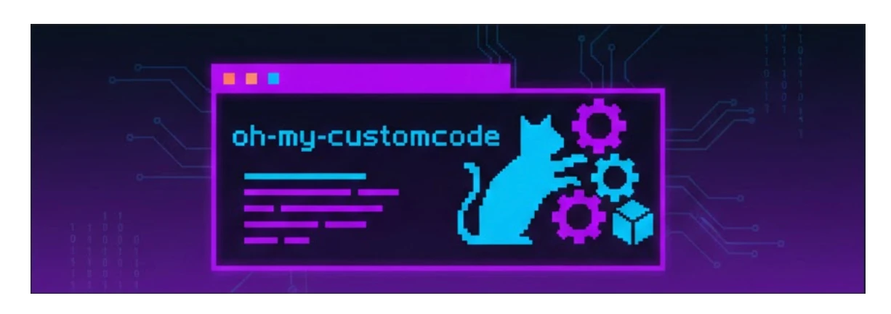
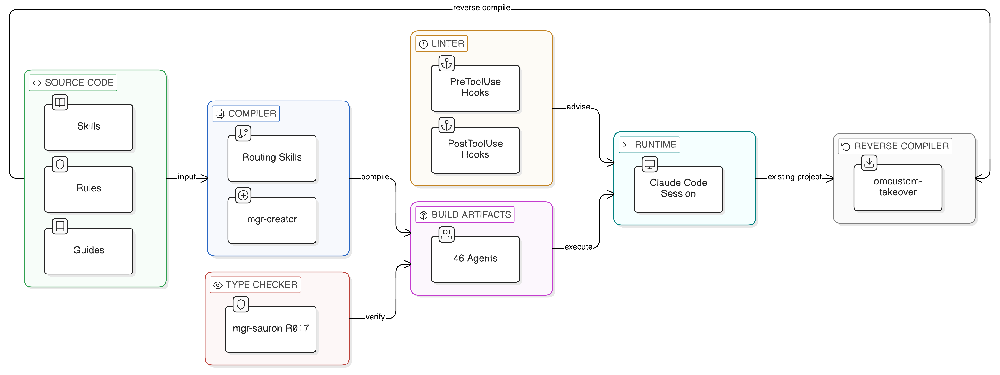
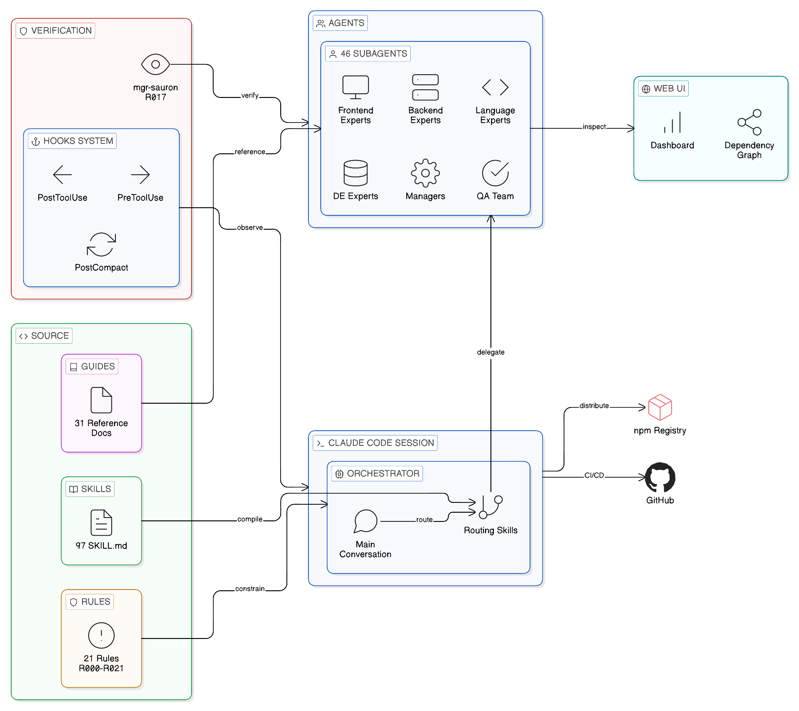

<div align="center">
  
</div>

# oh-my-customcodex

> **Your AI Agent Stack. Compiled, Not Configured.**

[](https://www.npmjs.com/package/oh-my-customcodex)
[](https://opensource.org/licenses/MIT)
[](https://github.com/baekenough/oh-my-customcodex/actions/workflows/ci.yml)
[](https://github.com/baekenough/oh-my-customcodex/actions/workflows/security-audit.yml)

**[한국어 문서 (Korean)](./README_ko.md)**

49 agents. 123 skills. 22 rules. One command.

```bash
npm install -g oh-my-customcodex && cd your-project && omcustomcodex init
```

---

## Philosophy

oh-my-customcodex is built on two ideas:

**1. Agent systems are compiled, not configured.**

| Compile Concept | oh-my-customcodex |
|----------------|-----------------|
| Source repository authoring | `.codex/skills/` — skill definitions maintained by this package itself |
| Installed runtime skills | `.agents/skills/` — reusable knowledge and workflows deployed into managed projects |
| Build artifacts | `.codex/agents/` — executable specialists assembled from skills |
| Compiler | `mgr-sauron` (R017) — structural verification and integrity |
| Spec | `.codex/rules/` — constraints and build rules |
| Linker | Routing skills — connect agents to tasks |
| Standard library | `guides/` — shared reference documentation |

Skills are source. Agents are compiled output. Sauron verifies the build. This separation means skills evolve independently of agents, and agents can be recompiled from updated skills at any time.

<p align="center">
  
</p>

**2. If it can't be done, make it work.**

When no specialist exists for a task, oh-my-customcodex does not fail. It creates one.

```
User: "Review this Terraform module"
  → Routing: no terraform expert found
  → mgr-creator discovers: infra-aws-expert skills + docker-best-practices guide
  → Creates: infra-terraform-expert.md
  → Executes the review immediately
  → Agent persists for future use
```

This is not a fallback. It is the design. The system treats missing expertise as a build problem — find the right skills, compile a new agent, execute.

---

## How It Works

### Orchestration

The main conversation acts as a singleton orchestrator (R010). It never writes files directly. Every action is delegated through routing skills to specialized agents.

```
User (natural language)
  → Routing skill (intent detection, confidence scoring)
    → Specialized agent (isolated execution)
      → Result returned to orchestrator
        → Response to user
```

Four routing skills cover the full domain:

<p align="center">
  
</p>

| Routing Skill | Routes To |
|--------------|-----------|
| secretary-routing | Manager agents (mgr-*), system agents (sys-*) |
| dev-lead-routing | Language, backend, frontend, tooling, DB, infra, arch agents |
| de-lead-routing | Data engineering agents (de-*) |
| qa-lead-routing | QA team (qa-planner, qa-writer, qa-engineer) |

### Model Selection

Each agent runs on the model optimized for its task:

| Model | When | Examples |
|-------|------|---------|
| `opus` | Complex reasoning, architecture | Design review, research synthesis |
| `sonnet` | Implementation, general tasks | Code generation, agent creation |
| `haiku` | Fast validation, search | File search, count verification |

The reasoning-sandwich pattern formalizes this: opus for pre-analysis, sonnet for implementation, haiku for post-verification.

### Parallel Execution

Independent tasks run in parallel (R009). Up to 4 concurrent agents per message:

```
Agent(lang-golang-expert):sonnet  ┐
Agent(lang-python-expert):sonnet  ├─ All spawned in one message
Agent(qa-engineer):sonnet         │
Agent(arch-documenter):haiku      ┘
```

---

### Agents (49)

| Category | Count | Agents |
|----------|-------|--------|
| Languages | 6 | lang-golang, lang-python, lang-rust, lang-kotlin, lang-typescript, lang-java21 |
| Backend | 6 | be-fastapi, be-springboot, be-go-backend, be-express, be-nestjs, be-django |
| Frontend | 5 | fe-vercel, fe-vuejs, fe-svelte, fe-flutter, fe-design |
| Data Engineering | 6 | de-airflow, de-dbt, de-spark, de-kafka, de-snowflake, de-pipeline |
| Database | 4 | db-supabase, db-postgres, db-redis, db-alembic |
| Tooling | 3 | tool-npm, tool-optimizer, tool-bun |
| Architecture | 2 | arch-documenter, arch-speckit |
| Infrastructure | 2 | infra-docker, infra-aws |
| QA | 3 | qa-planner, qa-writer, qa-engineer |
| Security | 1 | sec-codeql |
| Managers | 6 | mgr-creator, mgr-updater, mgr-supplier, mgr-gitnerd, mgr-sauron, mgr-claude-code-bible |
| System | 3 | sys-memory-keeper, sys-naggy, tracker-checkpoint |
| Auxiliary | 2 | slack-cli, wiki-curator |

Each agent declares its tools, model, memory scope, and limitations in YAML frontmatter. Tool budgets are enforced per agent type for accuracy.

---

### Skills (123)

| Category | Count | Includes |
|----------|-------|----------|
| Best Practices | 24 | Go, Python, TypeScript, Kotlin, Rust, React, FastAPI, Spring Boot, Django, Flutter, Docker, AWS, Postgres, Redis, Kafka, dbt, Spark, Snowflake, Airflow, pipeline-architecture-patterns, alembic, and more |
| Routing | 4 | secretary, dev-lead, de-lead, qa-lead |
| Workflow | 13 | structured-dev-cycle, deep-plan, research, evaluator-optimizer, dag-orchestration, worker-reviewer-pipeline, reasoning-sandwich, pipeline, and more |
| Development | 10 | dev-review, dev-refactor, analysis, create-agent, intent-detection, web-design-guidelines, omcodex:takeover, skill-extractor, pre-generation-arch-check, idea |
| Operations | 10 | update-docs, audit-agents, sauron-watch, monitoring-setup, token-efficiency-audit, fix-refs, release-notes, and more |
| Memory | 3 | memory-save, memory-recall, memory-management |
| Package | 3 | npm-publish, npm-version, npm-audit |
| Optimization | 3 | optimize-analyze, optimize-bundle, optimize-report |
| Security | 3 | adversarial-review, cve-triage, jinja2-prompts |
| Other | 13 | codex-exec, claude-native, gitlab, visual-ralph, visual-verdict, vercel-deploy, skills-sh-search, result-aggregation, writing-clearly-and-concisely, and more |

Skills use a 3-tier scope system: `core` (universal), `harness` (agent/skill maintenance), `package` (project-specific).

---

## Commands

All commands are invoked inside the oh-my-customcodex GPT Codex + OMX session.

### Development

| Command | What it does |
|---------|-------------|
| `/dev-review` | Code review against best practices |
| `/dev-refactor` | Refactor for structure and patterns |
| `/structured-dev-cycle` | 6-stage development: plan → verify → implement → verify → compound → done |
| `/deep-plan` | Research-validated planning |
| `/research` | 10-team parallel analysis with cross-verification |
| `/sdd-dev` | Spec-Driven Development workflow |
| `/ambiguity-gate` | Pre-routing ambiguity analysis |
| `/pre-generation-arch-check` | Check architecture risks before implementation |
| `/adversarial-review` | Attacker-mindset security code review |
| `/omcustomcodex:goal` | Keep a concrete objective in view through planning, execution, and verification |
| `/pipeline` | Execute YAML-defined pipelines |
| `/pipeline resume` | Resume a halted pipeline from last failure point |

### Agent Management

| Command | What it does |
|---------|-------------|
| `/omcustomcodex:analysis` | Analyze project, auto-configure agents and skills |
| `/omcustomcodex:create-agent` | Create a new agent |
| `/omcustomcodex:takeover` | Extract canonical spec from existing agent or skill |
| `/idea` | Turn a natural-language idea into structured issue specs |
| `/omcustomcodex:audit-agents` | Audit agent dependencies |
| `/omcustomcodex:update-docs` | Sync project structure and documentation |
| `/omcustomcodex:sauron-watch` | Full structural verification (5+3 rounds) |
| `/omcustomcodex:feedback` | Submit feedback as GitHub issue |

### Web UI

| Command | What it does |
|---------|-------------|
| `/omcustomcodex:web` | Control built-in Web UI (start, stop, status, open) |

### Package & Release

| Command | What it does |
|---------|-------------|
| `/omcustomcodex:npm-publish` | Publish to npm |
| `/omcustomcodex:npm-version` | Semantic versioning |
| `/omcustomcodex:npm-audit` | Dependency security audit |
| `/omcustomcodex-release-notes` | Generate release notes from git history |

### Memory & System

| Command | What it does |
|---------|-------------|
| `/memory-save` | Save session context |
| `/memory-recall` | Search and recall memories |
| `/omcustomcodex:monitoring-setup` | OTel monitoring toggle |
| `/token-efficiency-audit` | Audit and tune token-efficiency settings |
| `/omcustomcodex:loop` | Auto-continue background agent workflows (3-continue safety limit) |
| `/omcustomcodex:lists` | Show all commands |
| `/omcustomcodex:status` | System health check |

---

### Rules (22)

| Priority | Count | Purpose |
|----------|-------|---------|
| **MUST** | 14 | Safety, permissions, agent design, identification, orchestration, verification, completion, enforcement |
| **SHOULD** | 6 | Interaction, error handling, memory, HUD, ecomode, ontology routing |
| **MAY** | 1 | Optimization |

Key rules: R010 (orchestrator never writes files), R009 (parallel execution mandatory), R017 (sauron verification before push), R020 (completion verification before declaring done), R021 (advisory-first enforcement model).

---

### Guides (48)

Reference documentation covering best practices, architecture decisions, and integration patterns. Located in `guides/` at project root, covering topics from agent design to CI/CD to observability.

---

## Safety

oh-my-customcodex includes security and lifecycle hooks:

| Hook | Trigger | Action |
|------|---------|--------|
| secret-filter | Bash, Read output | Detects AWS keys, API tokens, private keys, bearer tokens |
| audit-log | Edit, Write, Bash, Agent | Append-only JSONL at `~/.codex/audit.jsonl` |
| schema-validator | Write, Edit, Bash input | Validates tool inputs, flags dangerous patterns |
| PostCompact | Context compaction | Reinjects enforced rules (R007–R018, R021) — prevents rule amnesia |

Security hooks are advisory (exit 0). They warn but never block.

---

## CLI

```bash
omcustomcodex init                  # Interactive setup wizard (language, framework, team mode)
omcustomcodex init --lang ko        # Initialize with Korean
omcustomcodex init --from-snapshot  # Install from pre-configured team snapshot
omcustomcodex sync                  # Detect drift between .codex/ state and lockfile
omcustomcodex sync --check          # Check for drift without applying changes
omcustomcodex sync --export         # Export current state as team snapshot
omcustomcodex update                # Update to latest
omcustomcodex list                  # List components
omcustomcodex doctor                # Verify installation
omcustomcodex doctor --fix          # Auto-fix issues
omcustomcodex security              # Scan for security issues
omcustomcodex projects              # List managed projects with version status
omcustomcodex update --all          # Batch update all outdated projects
omcustomcodex serve                 # Start built-in Web UI
omcustomcodex serve-stop            # Stop Web UI
```

---

## Project Structure

### Managed project runtime

```
your-project/
├── AGENTS.md                   # Entry point
├── .codex/
│   ├── agents/                 # 49 agent definitions
│   ├── rules/                  # 22 governance rules (R000-R021)
│   ├── hooks/                  # 15 lifecycle hook scripts
│   ├── schemas/                # Tool input validation schemas
│   ├── specs/                  # Extracted canonical specs
│   ├── contexts/               # 4 shared context files
│   └── ontology/               # Knowledge graph for RAG
├── .agents/
│   └── skills/                 # 123 installed skill modules
└── guides/                     # 48 reference documents
```

### Source Repository And Compatibility Surfaces

- This repository keeps package-authoring skills in `.codex/skills/`; that is a source-repo surface, not the installed project skill path.
- Installed projects use `.agents/skills/` for managed skills and `.codex/agents/*.md` for managed agents.
- `templates/.claude/` and `templates/CLAUDE.md*` remain upstream-compatible template inputs; they are not the active Codex runtime surface after install.
- `.codex/hooks/` is the OMX-managed hook script layer used by this package. Native Codex `hooks.json` discovery is a separate contract and is not generated by `omcustomcodex` today.
- Native Codex custom subagents in `.codex/agents/*.toml` may coexist, but `omcustomcodex` currently manages `.codex/agents/*.md` as its own agent contract.
- Project-scoped MCP configuration lives in `.codex/config.toml`, and the managed project registry lives in `~/.oh-my-customcodex/projects.json`.

---

## External Tool Integrations

RTK is automatically installed during `omcustomcodex init` for 60-90% token savings. Other tools are optional:

| Tool | Purpose | Install | Status |
|------|---------|---------|--------|
| [RTK](https://github.com/rtk-ai/rtk) | 60-90% token savings on CLI output | Auto-installed via `omcustomcodex init` | **Recommended** |
| [Codex CLI](https://github.com/openai/codex) | OpenAI Codex hybrid workflows | `npm i -g @openai/codex` | Optional |
| [Gemini CLI](https://github.com/google-gemini/gemini-cli) | Google Gemini hybrid workflows | `npm i -g @google/gemini-cli` | Optional |

When installed, each tool is **auto-detected** at session start and its features become available. When not installed, commands fall back to the built-in GPT Codex + OMX baseline or the next supported integration path.

---

## Development

```bash
bun install          # Install dependencies
bun run dev          # Development mode
bun test             # Run tests
bun run build        # Production build
```

Requirements: Node.js >= 18.0.0, Bun, Codex CLI. GitHub CLI (`gh`) and `jq` are recommended for release automation and local hook validation.

---

## License

[MIT](LICENSE)

---

<p align="center">
  <strong>No expert? Create one. Connect knowledge. Execute.</strong>
</p>

<p align="center">
  Made with care by <a href="https://github.com/baekenough">baekenough</a>
</p>
